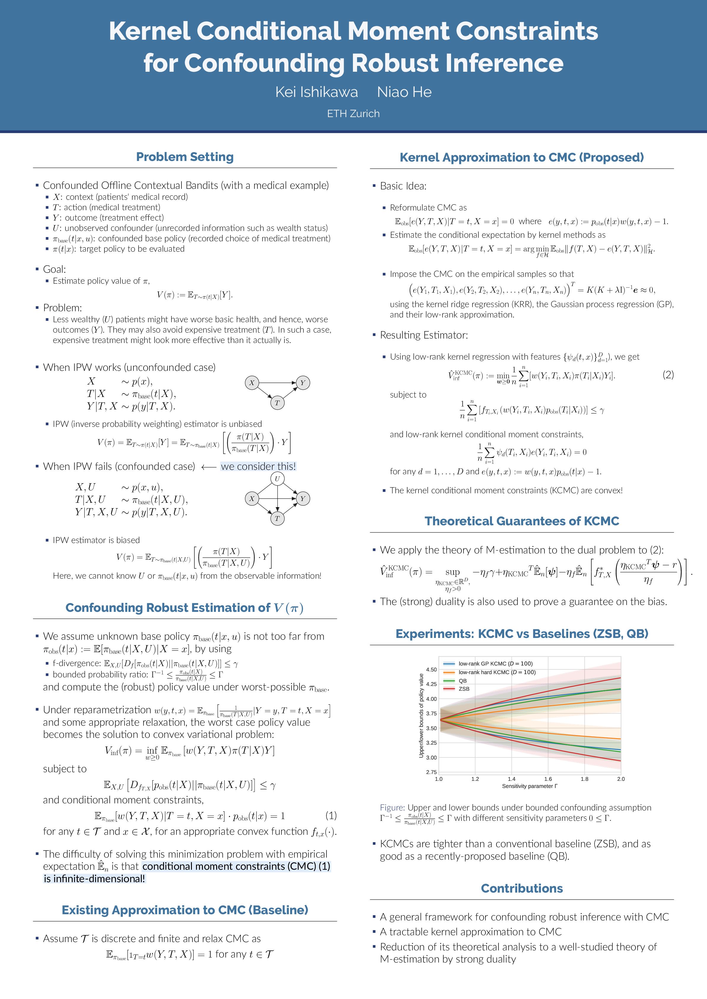

Kernel Conditional Moment Constraints for Confounding Robust Inference
======================================================================
[](https://arxiv.org/abs/2302.13348)
[](https://github.com/kstoneriv3/confounding_robust_inference/actions/workflows/docs.yaml)
[](https://github.com/kstoneriv3/confounding_robust_inferenc/LICENSE)

This repository contains the experimental code the paper [Kernel Conditional Moment Constraints for Confounding Robust Inference](https://arxiv.org/abs/2302.13348).
The core part of the code is provided as a python package `confounding-robust-inference` and the codes for the experiments can be found in the examples folder as jupyter notebooks.

Installation
------------

To install the package `confounding-robust-inference`, copy this repository locally, move inside of it, and install it as editable package with pip:
```bash
$ git clone git@github.com:kstoneriv3/confounding-robust-inference.git
$ cd ./confounding-robust-inference
$ pip install -e .
```


Documentation
-------------

Documentation is available at [https://kstoneriv3.github.io/confounding-robust-inference](https://kstoneriv3.github.io/confounding-robust-inference).


Development
-----------
For formatting, testing, and building documentation, we use `make` and `tox`.
If you would like to do these in your local environment, run
```bash
make
```
Alternatively, you can conduct these in an isolated environment using tox as 
```bash
tox
```


Citation
--------
If you found this library useful in your research, please consider citing [the paper](http://a.co://arxiv.org/abs/2302.13348).

```
@inproceedings{ishikawa2023kernel,
  title={Kernel Conditional Moment Constraints for Confounding Robust Inference},
  author={Ishikawa, Kei and He, Niao},
  booktitle={International Conference on Artificial Intelligence and Statistics},
  pages={650--674},
  year={2023},
  organization={PMLR}
}
```
